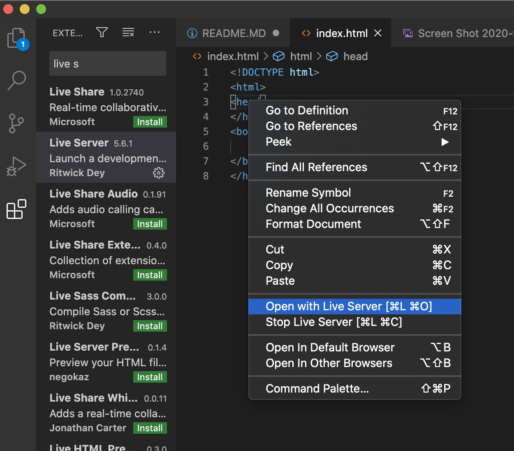
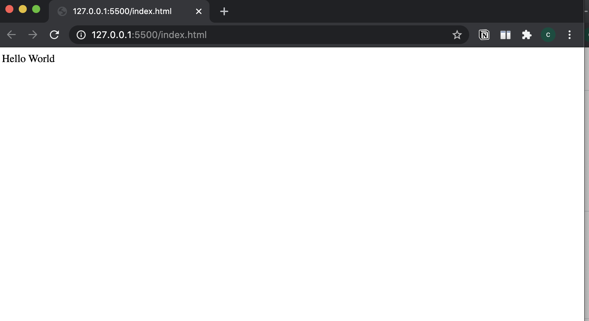
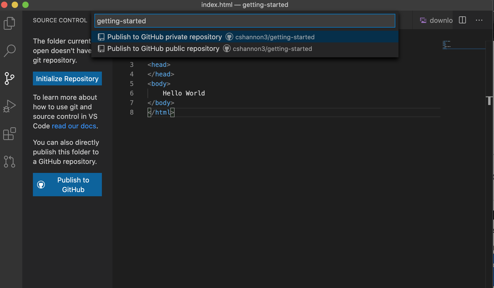
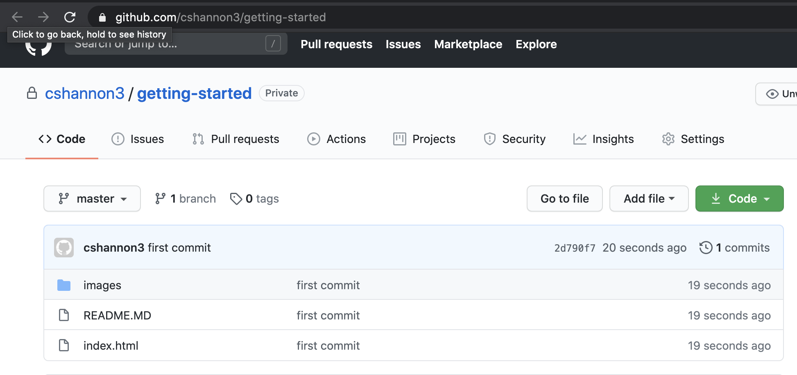

# A Getting Started Guide For HTML/CSS/JS


## How To Run Your Code<br>

**Running The Live Server with VS Code**

1. Go to [Visual Studio Code](https://code.visualstudio.com/) 
to download the software. 
2. Create a new folder called "hello world," go to visual code and open that empty folder.
3. Create a file called "index.html" and add in this html
```
<!DOCTYPE html>
<html>
<head>
</head>
<body>
    Hello World
</body>
</html>
```
4. Right click on the code and press "Open With Live Server"
<br>

<br>
You should see a window open in chrome with your code in it. Try changing "hello world" to something else then saving to make sure it works.
<br>

<br>
<br>

## Github Basics<br>
<br>
Github shouldn't be scary. You'll only need to use a few parts of it and should need to do anything crazy like the ssh stuff we did in lab. 
<br>

**Git vs Github**
Git is basically a fancy file directory(called a repository or repo) that makes it easier for you to track changes and work with multiple people on the same project without everything blowing up.

Github is a service that's built on top of git to make it easier to share and collaborate online. It basically provides a way to store, share, and connect to your code online.
<br>

**Git/Github Set**
1. **Signing in** -  Once you've made a github account, go to the bottom left icon, you should see something that says "Sign In." Click that to sign into your Github account. (this is an easier way of doing what we did in lab)

<br>

2. **Publishing to Github** - The easiest way to initially set up git for your project is to immediately publish it to a private repo on github so you don't have to do it later. If you go to the source control tab on the left(3rd item down), you should see a "Publish to Github" button. Click that and follow the prompts to allow VS-Code authorization. Once you're back in github, at the top of the screen a command will appear at the top to publish to git, click on that to create the remote repo. 

<br>

<br>
<br>
Here's what it should look like in github
<br>

<br>


**Using Git**

Once your git is set up it will track all the changes you make. If you look in the Source Control tab, you can see all of the files you've changed.


## Useful Resources
Git/Github Resources
- https://learngitbranching.js.org/?demo

Html/CSS/JS Resources
- [Mozilla Web Docs(MDN)](https://developer.mozilla.org/en-US/docs/Learn) Tons of resources for coding on the web. Html, css, and js.
- [https://www.w3schools.com/](https://www.w3schools.com/) - Along with MDN, this is the default place to go for webdev stuff 
 - [Flexfrog](http://flexboxfroggy.com/) - A cool game that helps you learn how to use the flexbox

<br>
<br>

## General Tips 
* I'll add some examples soon so these make more sense. If anyone else has additional tips, create a pull request(if you know how to do that) or send them to me in slack.

- **console.log() is your friend** - if you aren't sure what a value is or where the error is coming from debug by using console.log to figure it out
- **It doesn't have to look pretty to work** - your code will probably be pretty hacky, 
- **Layout then Looks then Function** - Start by coding the layout and just use empty boxes to represent the content. Then add the aesthetics and content. Finally add the interactions and data. I like to do most of this process for the first page before moving on to the next ones.
- **Break It Into Smaller Problems** - If you get stuck, try to find ways to break the problem into smaller sub-problems then work up from there.


